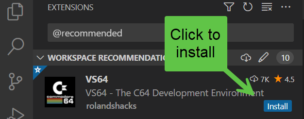

# x16  development tools

## Development Tools Setup

## Introduction

These are  the development tools needed for creating Commander x16 programs in assembly and BASIC.

### Workspace

Included in the workspace are extensions that can be used to compile assembly code and then run the emulator.

### Extensions

Goto extensions tab or shortcut ctrl+shift+x
at the search bar located at the top type in the area:

    @recommended

select workspace recommendations as shown in Figure 1

Figure 1

### VS64 C64 Development Environment

install VS64 - The C64 Development Environment as shown in  Figure 2

Figure 2 Click to install

Figure 3 Screenshot of VS64 extension

## VS64 Getting Started

open command palette by pressing
ctrl+shift+p
type

    VS64

select VS64: Getting Started as shown in  Figure 4

Figure 4 Screenshot of Getting Started

then fill in the settings

### ACME cross assembler

if necessary download the ACME cross assembler
or select from the bin directory

right click on acme.exe file and select copy path
paste the path in the settings to [path to ACME assembler installation]

under the build args add the following:

   --cpu 65c02

add emulator file location
example:

    D:\path\to\x16emu\x16emu.exe

add recommended emulator args

    -run -prg

### How to create ACME Assembler project

open command palette by pressing ctrl+shift+p
type:

    VS64

select VS64:create ACME Assembler project
this will create a framework for ACME project

## Developing

It is best practice to place source code in the  src folder.

## Retro Assembler (RA)

### RA Setup

make a copy of the retroassembler settings file
    bin\retroassembler\retroassembler-settings.xml

rename to

    bin\retroassembler\retroassembler-usersettings.xml

then edit this file to the following settings:

    <Setting Name="CpuType" Type="String" Value="65C02" />
    <Setting Name="OutputFormat" Type="String" Value="prg" />

    <Setting Name="AfterBuild" Type="String" Value="D:\\path\\to\\src\\copy.bat" />

    <Setting Name="Launch" Type="Boolean" Value="false" />
    <Setting Name="LaunchCommand" Type="String" Value="D:\\path\\to\\bin\\x16emu\\x16emu.exe -scale 1 -quality nearest -debug -prg {0}" />

* -scale 1 scale of display
* -quality nearest  quality of the display
* -debug debug mode
* -prg application
* {0} file compiled

contents of copy.bat

    @REM copy.bat
    copy /B /Y helloworldretro.prg D:\path\to\bin\x16emu\

this will copy the compiled file to the emulator directory ready for use with the emulator

### Testing setup

* Open the file src\helloworldretro.65c02.asm this file is setup to be complied by RA.
* With the file focused press the shortcut key for "Retro Assembler: Build & Start".
* This will compile and copy the prg to the emulator directory, run the emulator then load the file ready to run.

The 65c02 in the asm filename is to inform the RA to compile for this CPU.

## Kickassembler

## Cc65

## Llvm [here](https://llvm.org)

vscode variables-reference [here](https://code.visualstudio.com/docs/editor/variables-reference)
