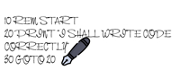
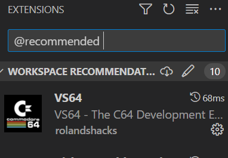

# x16  development tools

## Setup

### Workspace

### Extensions

goto extensions tab or shortcut ctrl+shift+x
at the top type in the search area:

    @recommended

select workspace recommendations as shown in Figure 1

Figure 1

install VS64 - The C64 Development Environment as shown in  Figure 2

Figure 2 Click to install

Figure 3 Screenshot of VS64 extension

## VS64 Getting Started

open command palette by pressing
ctrl+shift+p
type

    VS64

select VS64: Getting Started as shown in  Figure 4

Figure 4 Screenshot of Getting Started

then fill in the settings

### ACME cross assembler

if necessary download the ACME cross assembler
or select from the bin directory

right click on acme.exe file and select copy path
paste the path in the settings to [path to ACME assembler installation]

under the build args add the following:

   --cpu 65c02

add emulator file location
example:

    D:\path\to\x16emu\x16emu.exe

add recommended emulator args

    -run -prg

## How to create ACME Assembler project

open command palette by pressing ctrl+shift+p
type:

    VS64

select VS64:create ACME Assembler project
this will create a framework for ACME project

## Developing

It is best practice to place source code in the  src folder.
