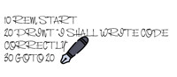

# Commander x16  development tools

## Commander x16 Website

[Visit Commander x16 Website](https://www.commanderx16.com/)

 

## Version

current version v0.2.0

## Introduction

This is a development environment for Commander x16 and Commodore 64 computers.
It is assumed that you have Visual Studio Code installed.

## Changelog

check the changelog.txt for history and list of changes

## Using the tools and Installation

Read the Instructions.md for how-to configure and use.

## Contributing

If you found an error, a typo or have an idea and wish to contribute
read the Contributing.md file

## Cloning

To clone create a subdirectory then change to that directory and use the following command from the command prompt:

        git clone  https://github.com/pacav69/x16devproject

this will copy the files to your computer into the created subdirectory.

## Tools used

* Visual Studio Code

Visual Studio Code Editor - [found here](https://code.visualstudio.com/)

* ACME Cross assembler [found here](https://csdb.dk/release/?id=193302)

## Videos and tutorials

* ChibiAkumas  [here](https://www.youtube.com/@ChibiAkumas)
* ChibiAkumas website [here](https://www.assemblytutorial.com/)
* TheRetroDesk [here](https://www.youtube.com/watch?v=gqwIzbT_WFU&ab_channel=TheRetroDesk)
* TheRetroDesk github files  [here](https://github.com/SlithyMatt/x16-assembly-tutorial)
* Commander X16 Assembly Project Setup [here](https://www.youtube.com/watch?v=V2vGiIqDXkA&ab_channel=JestinStoffel)
* Commander X16 6502 Assembly Language Dev Setup [here](https://www.youtube.com/watch?v=oz3E6pGU2KE&ab_channel=Spriteworx)

## Visual Studio Code extensions

* VS64 - The C64 Development Environment  [here](https://marketplace.visualstudio.com/items?itemName=rosc.vs64)
* C64 [here](https://marketplace.visualstudio.com/items?itemName=gverduci.c64basicv2)
* kick-assembler [here](https://marketplace.visualstudio.com/items?itemName=paulhocker.kick-assembler-vscode-ext)
* Some VSCode extensions in 2023 video [here](https://www.youtube.com/watch?v=DNf6Bu7z4vw&ab_channel=DevtipsbyMoHo)

### Commander x16 links

* reference  manual [here](https://github.com/x16community/x16-docs)
* forum [here](https://www.commanderx16.com/forum)
* Commander x16 emulator [here](https://github.com/x16community/x16-emulator)
* retro-code  gitlab [here](https://gitlab.com/retro-coder/commanderx16)

### Data sheets

* [W65C02](https://eater.net/datasheets/w65c02s.pdf)
* [W65C22 (VIA)](https://eater.net/datasheets/w65c22.pdf)
* [W65C51 (ACIA)](https://eater.net/datasheets/w65c51n.pdf)

## C64 References

* Existing reference material [here](https://github.com/X16Community/x16-docs/issues/83)
* cbm docs [here](https://sta.c64.org/cbmdocs.html)
* C64 collections [here](https://www.lyonlabs.org/commodore/onrequest/collections.html)

* cbm64 kernal function  [here](http://sta.c64.org/cbm64krnfunc.html)
* c64 kernal ROM  [here](https://c64os.com/post/c64kernalrom) pretty good writeup with explanations
* c64 reference  [here](https://www.pagetable.com/c64ref/kernal/)

Here's some more, courtesy of @JimmyDansbo :

* c64 kernal routines [here](https://www1.cx16.dk/c64-kernal-routines/)
* c128-kernal-routines [here](https://www1.cx16.dk/c128-kernal-routines/)
* 6502opcodes [here](http://6502.org/tutorials/6502opcodes.html)
* 65c02opcodes [here](http://www.6502.org/tutorials/65c02opcodes.html)

Maybe less useful on the x16:

* C64 dissembler [here](https://www.pagetable.com/c64ref/c64disasm/)
* map c6411 [here](https://project64.c64.org/Software/mapc6411.txt)

### Assemblers

* Acme cross assembler for windows [here](https://sourceforge.net/projects/acme-crossass/files/win32/acme0.97win.zip/download)
* cc65 compiler [here](https://cc65.github.io/)
* KickAssembler main page [here]( http://theweb.dk/KickAssembler/Main.html#frontpage)
* KickAssembler zip file [here](http://www.theweb.dk/KickAssembler/KickAssembler.zip)

### Emulators

* Commander x16 [here](https://github.com/x16community/x16-emulator)
* SNES emulator (FCEUX) [here](https://fceux.com/web/home.html)
* BizHawk is a multi-platform emulator  [here](https://tasvideos.org/Bizhawk)

## Support

[Help support by buying some merchandise](https://cavtronics-3.creator-spring.com/)

## Acknowledgements
